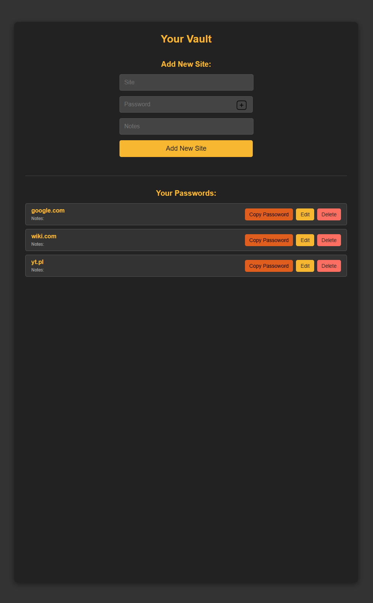
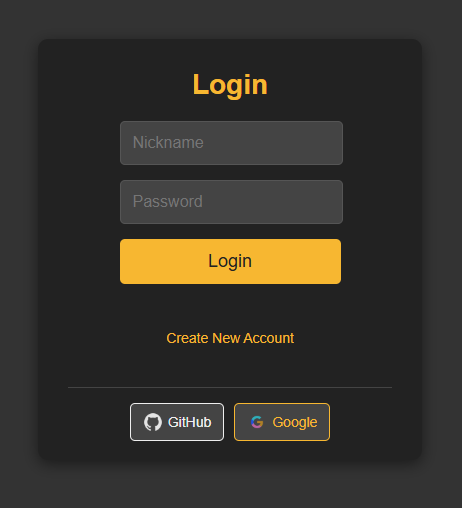
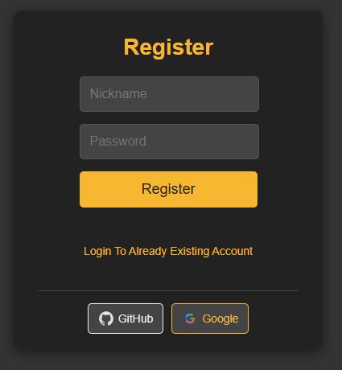

# 🔐 Go Password Vault

A simple password vault web application built with [Gin](https://github.com/gin-gonic/gin), using **sessions with cookies**, SQLite database, and HTML templates.  
This project demonstrates secure user authentication, session handling, and CRUD operations for managing stored sites.

---

## ✨ Features

- 🔑 User registration & login
- 🍪 Session-based authentication (cookies)
- 📦 Secure vault for storing site credentials
- ✏️ Add / Edit / Delete sites
- 🎨 Basic styling with custom CSS
- 🗄️ SQLite database storage
- 📷 Screenshots included

---

## 🖼️ Screenshots

  
  
  

---

## ⚙️ Tech Stack
- Backend: Go + Gin framework
- Database: SQLite (via database/sql) (in future transfer to docker)
- Session Handling: gin-contrib/sessions
- Templating: Go HTML templates
- Frontend: HTML, CSS
- Authorization: OAuth2

## 📌 To Do

See [todo.txt](todo.txt)
for planned improvements.
